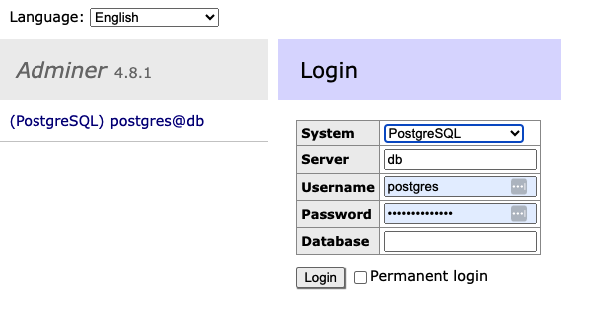
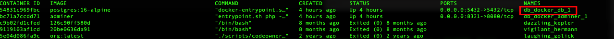

# my-todo-list-backend

This is the repo for the rest API service and the DB part of the My Todo App. The repo for the frontend is [here](https://https://github.com/addisonchan/my-todo-list-frontend), and the spec of the API called by this frontend is [here](https://github.com/addisonchan/my-todo-list-service-pact)

## Overall Tech Design

This is the diagram of the ovarall tech design.  

  

The source of the diagram is [here](https://github.com/addisonchan/my-todo-list-service-pact?tab=readme-ov-file#overall-tech-design).

## Prerequisites

To set up the front end app at a machine, the follow(s) must be needed first:

- Install [NodeJS](https://nodejs.org/en) (Recommended version is 18)
- Install [Docker](https://www.docker.com/)

## Setup

Here are the steps to set up the front after the prerequsistes above are fulfilled.

### A. Postgresql DB

Prior to any API service setup, we start the Postgresql DB first. To run the DB, we need to be in the directory `docker_db`. Here is the DB setup steps:

**1. Go to `docker_db` directory**  
Run `cd docker_db`  
**2. Create and run docker container**  
Run `docker-compose up`  
**3. Check if the DB is running**  
Open up a browser and put in this url: `http://localhost:8321/`. The user name and password can be find in [the docker compose yaml](./db_docker/docker-compose.yml). Remember to pick the "System" as PostgreSQL.  
  

To run the DB for the second or latter time, we don't need to create or compose the docker again. You only need to check the name of the previously created container and start the container again.

For example, run this command to check the DB container's name: `docker container ls -a`  
  

Then, run this docker command to start the container (**if the container name is "db_docker_db_1"**):  
`docker start db_docker_db_1`
To stop, run:  
`docker stop db_docker_db_1`

### B. API Service

After setting up the DB, we can proceed to the API service setup. Here are the steps.

**1. Install all the node modules**  
Run this command: `npm install`
Or this: `npm install --force`

**2. Build the app**  
Run `npm run build`

**3. Serve the app**  
Run `npm run start`

**4. Test the APIs**  
There are some sample curl commands can be tried to test the API service:  

- Get all todos: `curl --location --request GET 'http://localhost:3000/api/todos'`
- Create a todo: `curl --location --request POST 'http://localhost:3000/api/todos' \
--header 'Content-Type: application/json' \
--data-raw '{
  "id": "V1StGXR8_Z5jdHi6B-myB",
  "text": "Something to do",
  "isDone": false
}'`
- Update a todo: `curl --location --request PUT 'V1StGXR8_Z5jdHi6B-myB' \
--header 'Content-Type: application/json' \
--data-raw '{
  "id": "V1StGXR8_Z5jdHi6B-myB",
  "text": "Something else has done",
  "isDone": true
}'`
- Delete a todo: `curl --location --request DELETE 'http://localhost:3000/api/todos/V1StGXR8_Z5jdHi6B-myB'`

If you want to update the configuration for the DB, the configuration is in [the dotenv file](./.env).

## Development Environment

Here are also some other commands for development:

- Unit Test:
`npm run test`
- Lint Check:
`npm run lint`
